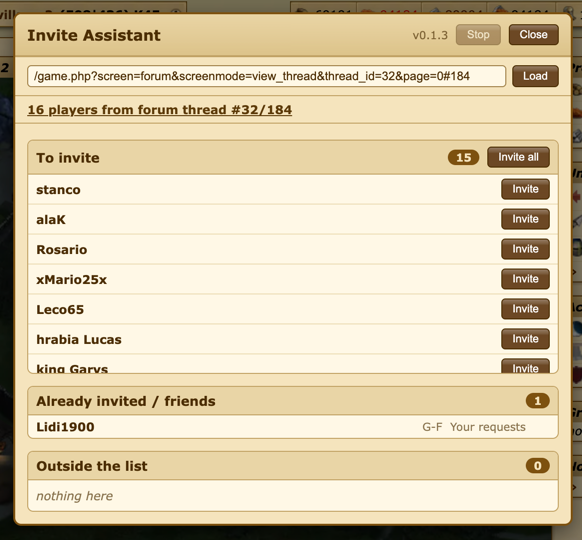

Friend-invite assistant. It compares a target player list (your tribe, named tribes, or a list posted on the tribe forum) with your friends list and shows three lists:

1. [b]To invite[/b] - everybody missing from your list, with an [i]Invite all[/i] button. Players from the target tribes who invited *you* sit on top of it with an [i]Accept[/i] button
2. [b]Already invited / friends[/b] - who is already there; each row shows the section the game put them in, so a pending request is easy to tell from an accepted friend
3. [b]Outside the list[/b] - everybody on the friends screen who is not on the target list, with [i]Remove[/i], each row labelled with the tribe they play for. That includes a request from somebody you are not looking for: removing it declines the request

Works from any screen (everything is fetched in the background) and on mobile.



[b][u]Configuration in the link[/u][/b]

The whole configuration travels in the script URL, so the tribe council hands out one ready-made link:

```js
// your own tribe (default)
javascript:$.getScript('https://.../script.js');

// named tribes, by tag
javascript:$.getScript('https://.../script.js?tribes=SNTX,G-F');

// a list posted on the forum - the whole address from the browser bar can be pasted in,
// including the #post anchor (then only that post is read)
javascript:$.getScript('https://.../script.js?thread=https://zz1.tribalwars.works/game.php?village=3350%26screen=forum%26screenmode=view_thread%26thread_id=32%26page=0%23184');

// short form of the same thing
javascript:$.getScript('https://.../script.js?thread=32&post=184');
```

Whatever the link says lands in the source field at the top of the panel, so everyone can see what they are working from and change it - type tribe tags (`JN, JN!`) or paste a forum thread address, then press Enter or *Load*. An empty field means your own tribe.

A forum post may link tribes (`[ally]`) or players (`[player]`); if it holds plain tags as text, they are resolved through `/map/ally.txt`. Tribe members are read from `screen=info_ally`, so they are always current - no waiting for the daily world data dump